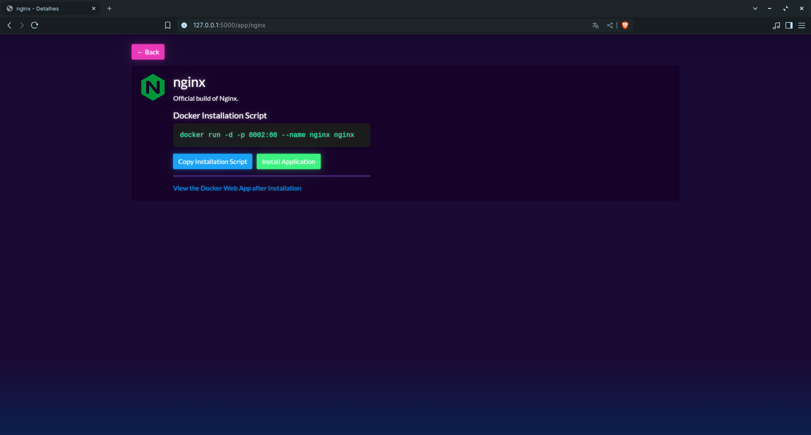

# 🐳 Docker Official Apps Explorer

A Flask-based web application that allows users to explore official Docker Hub images, view details, and generate ready-to-run `docker run` install commands.

---

## ✨ Features

- View official Docker images with icons and descriptions
- Generate `docker run` scripts with unique ports for each app
- Two modes:
  - **Online Mode**: Fetches live data from Docker Hub API
  - **Offline Mode**: Uses local JSON file for offline availability
- Lightweight UI using HTML templates
- Caching and background updating in online mode to keep the app data up to date
- Search functionality to easily find apps by name
- Install Docker apps directly using the provided `docker run` commands

---

## 🚀 Getting Started

### 🔧 Prerequisites

- Python 3.7+
- `pip3` for installing dependencies
- Internet connection (for online mode and dockers installations)

### 📦 Install Dependencies

Make sure to install all required dependencies by running:

```bash
pip3 install -r requirements.txt
```

*(If `requirements.txt` is not present, just run: `pip3 install flask requests`)*

---

## 📁 Project Structure

```plaintext
.
├── main.py                 # Online mode using Docker Hub API
├── offline.py              # Offline mode using local JSON file
├── saveDockerinJSON.py     # Script to fetch data from Docker Hub and create 
├── dockers.json            # Static data file for offline mode
├── original.json           # All JSON data fetched from API 
├── static
│   ├── default-icon.png    # PNG image with the default app icon
│   └── preview.png         # Screenshot for README preview
├── templates
│   ├── index.html          # Main HTML page listing all apps
│   └── details.html        # Details HTML page for each app
└── README.md               # This file
```

---

## 🌐 Online Mode

**File**: `main.py`

This version fetches official Docker apps from Docker Hub using their search API and caches the results in memory. It assigns unique ports and allows easy `docker run` generation.

### 🔍 Run Online Mode

To start the app in online mode, run the following command:

```bash
python main.py
```

Access the app in your browser at: [http://localhost:5000](http://localhost:5000)

---

## 📦 Offline Mode

**File**: `offline.py`

This version loads apps from a static JSON file (`dockers.json`) and provides the same interface without requiring internet access. This mode is perfect for situations where an internet connection is unavailable.

### 📂 Run Offline Mode

To run the app in offline mode, use:

```bash
python offline.py
```

Access the app in your browser at: [http://localhost:5000](http://localhost:5000)

---

## 🖼 HTML Templates

**Folder**: `templates/`

- `index.html`: Lists all available Docker apps with name, icon, description, and install script.
- `details.html`: Displays additional details about the selected app and the corresponding `docker run` command to install it.

---

## 🖼️ Preview
<br>

### List of APPs


### Details of APP


*Docker App Store (main.py/offline.py)*

---

## 🛠 Future Improvements

- Add Dockerfile generation for users to easily containerize their applications.

---

## 🤝 Contributions

Pull requests and suggestions are welcome. For major changes, please open an issue first to discuss what you would like to change.

---

## 📜 License

This project is open-source under the [MIT License](LICENSE).

---
